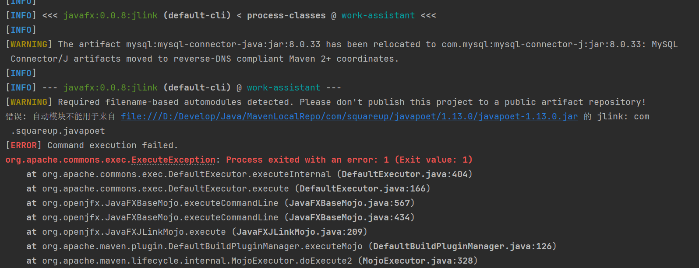

# javafx:jlink报错

错误: 自动模块不能用于来自 file:///xxx/com/squareup/javapoet/1.13.0/javapoet-1.13.0.jar 的 jlink: com.squareup.javapoet

参考：https://blog.csdn.net/qq_37945670/article/details/139705914

我们需要把我们的自动模块经过重新打包生成module-info.java这个文件，并让它打入JAR包内

jdeps是jdk自带的依赖分析工具，这个针对简单的依赖浅的JAR很有效，如果说依赖树很深的情况下，建议先排查一下依赖，从最底层的开始操作，但是我这里的JAR包无其他依赖，所以直接操作就行了， 其中的

- –ignore-missing-deps：忽略错误依赖
- –generate-module-info: 生成模块信息文件module-info.java,后面是模块信c息文件输出位置

jdeps --ignore-missing-deps --generate-module-info . json-20231013.jar

执行完成之后就会看到生成一个Module-info.java的文件，我们需要把它再编译成class，然后再打入jar里面

2、编译module-info.java
–patch-module指的是用于将一个或多个JAR文件或目录添加到指定模块的编译路径中，是key=value形式的，表示你要将json-20231013.jar中的内容作为org.json模块的一部分。
org.json/module-info.java 这是你要编译的module-info.java文件的路径。此文件定义了org.json模块的模块描述符。
p 参数(可选)，如果你的JAR需要依赖其他jar，比如json，那么你就需要加上-p参数指定jar包，这样打出来的module-info.java才会包含requires org.json，如果代码里面依赖了json，然而你却没有在module-info.java中requires，那么打出来的JAR执行就会报错

javac --patch-module org.json=json-20231013.jar org.json/module-info.java

将module-info.class注入到JAR中

u 这个选项用于更新现有的JAR文件，即在已有的JAR文件中添加或替换文件。
f 这个选项指定JAR文件的名称，后面跟着JAR文件的路径。
json-20231013.jar 这是要更新的JAR文件的名称。
-C 这个选项用于改变目录。-C dir选项告诉jar工具在切换到dir目录后再执行后续的文件操作。这个选项对于处理目录结构很有用。
module-info.class 这是要添加到JAR文件中的具体文件，即模块描述符的编译类文件。
jar uf json-20231013.jar -C org.json module-info.class

# Maven控制台乱码

-Dfile.encoding=GBK

